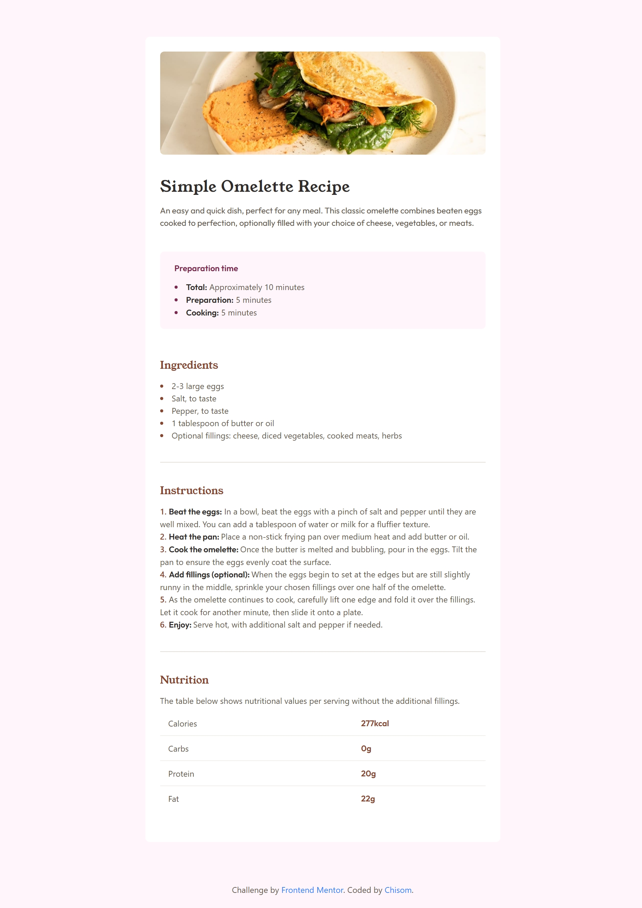

# Frontend Mentor - Recipe page solution

This is a solution to the [Recipe page challenge on Frontend Mentor](https://www.frontendmentor.io/challenges/recipe-page-KiTsR8QQKm). Frontend Mentor challenges help you improve your coding skills by building realistic projects. 

## Table of contents

- [Overview](#overview)
  - [Screenshot](#screenshot)
  - [Links](#links)
- [My process](#my-process)
  - [Built with](#built-with)
  - [Continued development](#continued-development)

- [Author](#author)

## Overview
I completed the frontend mentor challenge of building a reciep page. i built it with **HTML** and **Tailwind CSS**. I learnet how to design a table with **Tailwind CSS**
### Screenshot

### Links

- Solution URL: [Add solution URL here](https://your-solution-url.com)
- Live Site URL: [Add live site URL here](https://your-live-site-url.com)

## My process

### Built with

- HTML5 markup
- Tailwind CSS 
- Flexbox
- Vercle for deployment

### Continued development

After working on this challenge i will have to work on how to use tailwind CSS to design a good table

## Author

- Linkedlin - [Chisom](https://www.linkedin.com/in/chisomworlu)
- Frontend Mentor - [@Chisomworlu12](https://www.frontendmentor.io/profile/Chisomworlu12)
- Twitter - [@chisomwo](https://x.com/chisomwo)

